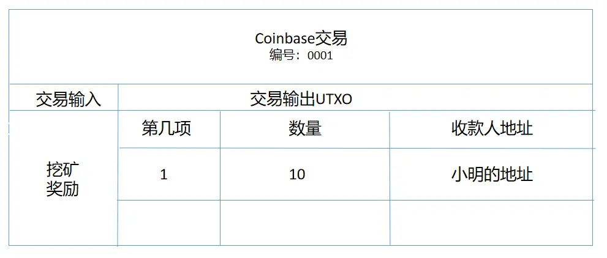
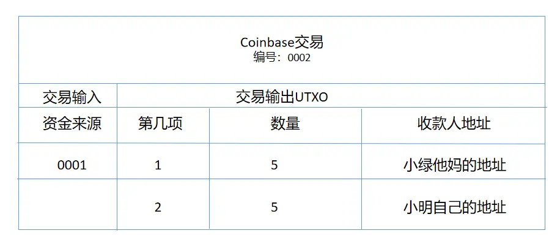

# 用java实现一个简单的区块链：UTXO交易模型

在上一篇[用java实现一个简单的区块链](https://juejin.im/post/5dddfb826fb9a071735e1ed0)中，我们主要讲了什么是区块链（提示:`区块链就是谈恋爱`），以及区块链是如何做到去中心化，不可篡改性的。然后就是通过解析国外一篇关于java区块链的文章，用java实现了一个简单的区块链，当然，我们最后做出来的那个东西实在是有点太过于简陋，原因是缺少了一个极为重要的流程-`交易`，再去描述如何用代码去实现具体的交易逻辑之前，我们首先需要先了解一个区块链是如何进行交易的，具体的交易逻辑又是怎么样的等等这些问题，本篇文章，我们主要是从UTXO交易模型出发，浅入去了解一下UTXO交易系统究竟是如何运作的，和传统的账户余额模型相比又有些什么样的优势？

少废话，直接上东西

## 什么是UTXO交易模型？

`UTXO`（Unspent Transaction Outputs）是未花费的交易输出，提出者是中本聪。它是比特币交易生成及验证的一个`核心概念`。交易构成了一组`链式`结构，所有合法的比特币交易都可以追溯到前向一个或多个交易的输出，这些链条的源头都是挖矿奖励，末尾则是当前未花费的交易输出。

每笔交易都有若干`交易输入`，也就是`资金来源`，也都有若干笔`交易输出`，也就是`资金去向`。一般来说，每一笔交易都要花费（spend）一笔输入，产生一笔输出，而其所产生的输出，就是“未花费过的交易输出”，也就是 UTXO。

 ？？？ 没看懂，抬走下一个。 

的确，这个概念是有点小复杂，我搁这想半天也没想出来啥奇妙的比喻（`jojo梗`），如果上一篇文章我们把区块链比作是谈恋爱的话，那么**UTXO就是结婚送彩礼**，前面是讲我们是怎么挖到矿的，UTXO就是讲我们挖到的这笔钱是怎么花的。

在上一篇文章的故事中，我们说到了由于区块链的不可篡改性，`小绿`肯定会发现`小明`是个渣男欺骗了她，考虑到我们这章讲的是UTXO交易模型，`小绿`就不得不选择原谅`小明`，并且还要答应小明的求婚。为了便于大家下面的理解，我打算先搬出来我们的次世代革命性产品-**别逼币**。

`小明`：哎，小绿他妈竟然给我要五个别逼币的彩礼（不是骂人），我从哪弄这么多别逼币去，还跟我说什么如果真心爱我们家小绿就别逼逼，一手交币，一手交绿，这不明摆着打劫么不是。

当天色渐晚的时候，郁闷的`小明`想起了自己家里的那台陪伴着自己长大的矿机，虽然它一次也没挖到矿，每次启动电表都要倒转，但是`小明`依然爱它，谁让它接的是邻居家的电线呢。晚上小明坐在`矿机`前面，按下了那被岁月附着了无数灰尘的开机键，随着一声声轰隆轰隆的机器声，一行小字缓缓显示在了屏幕上面：

> 好运来，鸡你太美，**挖到合格哈希**，一块钱四个，贱卖，嘿嘿，奥利给，谁tm买小米儿

上一篇文章我们说到过，**挖矿的本质其实就是通过哈希计算得到符合条件的hash的过程。**但是问题在于，我计算出来的hash字符串又是如何和比特币产生联系的？它们两个明显都不是一个东西啊，关键就在`UTXO交易模型`上，那些矿场又是买矿机，又是交电费的，花那么大的算力好不容易挖出来一个新的区块，如果没办法转化成比特币的话那不是亏死，`挖矿毕竟不是扫雷`  原因就在这，每当矿工计算出一个合格的区块的时候，该矿工就拥有了一个特权，那就是允许创造一个`初始的交易`（ coinbase），并且可以在里面放上一笔新钱。

放在现在的账户余额交易系统里面，就意味着如果你计算出一个新的区块，那么你就得到了一个特权，允许你直接在你银行账户余额的基础上合法地加上指定的金额，当然也不是无限加，要不玩命往上加的话谁还挖什么矿，比特币的话，现在每解锁一个新区块将获得`12.5个比特币`的奖励 ，这么一操作我们计算出来的hash就实实在在地蜕变成我们的比特币。

可能是因为爱情的力量，小明竟然成功地挖到一个区块，并且得到了创建一笔为10个`别逼币`初始交易的特权，于是小明在这笔交易的收款栏填写了自己钱包的地址，当然这还没完，由于区块链是去中心化的，需要更多的人认可才能保证这笔交易是合法的，不可窜改的，于是小明需要分别向六个节点去显摆这件事。

`小明：`看见了没，刚挖的，热乎乎的别逼币，10个，我全给打我钱包里了，不信，这是账单，羡慕吧，羡慕死你。

`节点：`知道了，滚。

经过六个节点的确认之后，这10个别逼币就正式地合法地划到了小明的名下。

`小明`：钱有了，剩下的就是去小绿家把彩礼交了把小绿娶回来了，剩下的5个别逼币还可以带小绿去王者峡谷度个蜜月什么的。

但是`别逼币`和`美元`这种纸币不一样，不能说我给你10快，你找我5快那么简单，数字货币之所以安全，是因为除了初始的`coinbase`交易之外，其它所有的资金来源都必须来自于前面某个交易或者几个交易的UTXO，就跟链表一样，一个接一个，这就保证了区块链的任何一笔交易都是可查的，任何一个交易被篡改，链表就不可能正确接上去，所有就很容易验证这笔交易是不是合法的。而区块链中大家都可以创建订单进行交易，数字货币作为一个货币而言流动性就有了。

这个时候很多人就要问了，那第一笔交易之前指向谁呢？

问的好（谁问了？），在比特币中，第一笔交易前一个交易为`0`。

第二个**就是任何一笔交易的交易输入（资金来源）必须要等于交易输出（资金去向）**

对于小明来说，就自己有10个别逼币，但是交彩礼的时候，不能一次只花5个别逼币，而是一下都要把这10个别逼币全部花出去，只不过，其中5个支付给了小绿他妈，5个支付给了自己。

在区块链中，小明交彩礼的订单大概如下图所示：

这个订单一共产生了两个输出，也就是两个`UTXO`，一个是小绿他妈的，一个是小明自己的。

而且我们会发现，在整个交易过程中并没有什么余额的概念，有的只是每一笔交易的`输入`和`输出`，这个时候有的人可能就疑惑了，你这不对啊，那我比特币钱包里面明明显示我还剩5个比特币啊，这个余额并不是类似于银行系统显示的你的账户余额，而是比特币钱包在扫描了整个区块链所有的交易之后，通过聚合所有**收款人是你**的交易的金额计算出的。

就是说当你的钱包在扫描整个区块链交易订单的时候，发现 ，诶，这有一笔最新的交易地址填的是你的地址，于是就加进来算成你的余额，当把所有指向你交易的订单汇总计算之后，这个值就是你拥有的正确余额，在比特币系统中就是你拥有的比特币数量。

为什么一定要是最新的那一笔交易呢，比如说前面小明的输出，挖矿的时候产生了一笔10个别逼币输出的订单，然后交彩礼的时候又产生了一笔5个别逼币输出的订单，如果直接聚合相加的话，那么得到小明的余额是**15**个别逼币，显然这是不对的，因为一笔新的交易是建立在之前的那笔订单之上的，所以当一笔新的交易诞生的时候，之前的那笔订单在统计的时候就会被认定为是过期的，而小明正确的余额就最新的订单的输出聚合计算的结果，在本例中，也就是小明交彩礼生成的那个订单，也就是小明还有5个别逼币。

划重点，朋友们要考的。

不论是比特币还是莱特币，其实说到底，**根本没有什么所谓的数字货币，一切都只是UTXO而已**。

## UTXO和账户余额相比较优势在哪里？

- 第一个：由于`UTOX交易模型`每一笔交易都可以追溯到与之对应的上一笔交易直至追溯到它诞生时挖出来的那个区块为止，也就是链表找到头，这个机制确保了区块链的不可伪造性，即一笔交易不可以被重复支付。

- 第二个：相对于传统的账户余额模型，UTXO由于只记录最终状态，因为统计余额的时候只需要统计最新的订单就好了，数据库体积要比传统账户余额模型小很多。

但是这并不意味着传统账户余额相对于UTXO就一点优势也没了，首先，`UTXO`本身的实现逻辑上要比`账户余额`复杂的多，其次是账户余额可以很方便地看出整体，比如这个城市所有人的余额近几年是如何变化的，有着更好的发挥空间，而且相较于比特币那种动不动就 `0.00000001` 个比特币，传统账户余额可以很方便的控制交易的精度。

## 下面开始技术总结：

磕磕碰碰终于把这篇文章写完了，相对于上一篇文章，这篇文章可能更加偏向于概念，`UTXO交易模型`对于经常编程的工程师来说并不是特别难于理解，但是对于刚刚接触编程或者区块链技术的人来说就确实有些抽象了，本篇文章在写的过程中的确也下了许多功夫，意在希望让各个阶段的人都可以看懂这篇文章，知道UTXO交易模型是什么。本来想和生活中类比一下，结果发现UTXO似乎是天然为区块链数字货币设计的一样，想不到什么特别合适的比喻，于是只能沿着上一篇文章的脉络接着往下写了。了解了UTXO的运作机制之后，下一篇文章我们仍然以国外的那两篇博客第二篇入手，以一个coder的角度去看UTXO在实际的开发中又是如何实现的，实现一个可交易的区块链系统。

相关代码已经上传至本人github。一定要点个**star**啊啊啊啊啊啊啊

**万水千山总是情，给个star行不行**

[韩数的开发笔记](https://github.com/hanshuaikang/HanShu-Note)

欢迎点赞，关注我，**有你好果子吃**（滑稽）

